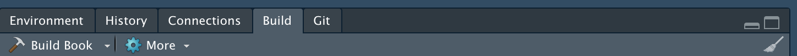

# Contributing guide {#contribute}

## Why contribute?

Given that we work on similar topics and share a similar infrastructure, we also have a lot of common tasks. For example, every new member will have to learn how to use the Ryten server, or `R` in general, or potentially run RNA-seq alignment/QC. This can be daunting at first and this book aims to ease that transition. The more comprehensive this book is, the better the experience of future or existing Ryten lab members will be. Thus, we would encourage all Ryten Lab members to contribute.

## What should I contribute?

If you have a workflow that you've been asked from a colleague more than once to explain or share code, then it's worth considering whether it should be part of this book. The more common the task, the more useful it will be when sitting in this book. From experience, the easiest time to add new workflows/instructions is during the time you actually conduct that workflow yourself so when you're next asked to run that gene-set enrichment analysis, consider documenting that run here, even if it's just a page with links to your code on GitHub/the server.

## How should I contribute?

This book is built using the R package `bookdown` [@R-bookdown]. A brilliant guide for the comprehensive functionality of `bookdown` is written by the author of the package Yihui Xie [here](https://bookdown.org/yihui/bookdown/). If you're interested in writing your own book, we'd suggest checking it out.

However, below is a small guide to get you started if you want to contribute to this book.

### Basics

1.  **Prerequisites.** Install the `bookdown` R package. And also the package `rsconnect` if you want to publish this book to <https://bookdown.org/rytenlab/ryten_induction/>.

```{r install-bookdown, eval = FALSE}
install.packages("bookdown", "rsconnect")
```

2.  **Clone the repository containing this book.** If you're unfamiliar with GitHub or `git`, check out this [guide](https://happygitwithr.com/).

```{bash clone_ryten_induction, eval = FALSE}
git clone https://github.com/rytenlab/ryten_induction.git
```

3.  **Adding a new page.** Familiarize yourself with the structure of the book. The [usage](https://bookdown.org/yihui/bookdown/usage.html) page of the bookdown guide gives a nice overview. In brief, `.Rmd` docs are the pages of the book. The `index.Rmd` serves as the header/preface/first page of the book. The remainder of the `.Rmd` files are labeled with "01-PAGE-NAME" and form the pages of this book. To create a new page, just make a new `.Rmd` and name it with an informative title. Bear in mind that the pages will be ordered by their alphanumerical name (01, 02, 03...). The contents of each `.Rmd` (except `index.Rmd`) is expected to have one "\#" prefixed title, which will be the title of the page. If you want to include subsections, then use "\#\#" or "\#\#\#" etc. The rest of the page structure follows the traditional `.Rmd` syntax. 

> By default, `.Rmd` files have a YAML header at the top contained within the "---"s. If you are making a new page please remove these, leaving just a "\# PAGE TITLE" at the top. The YAML header for the entire book can be found in the `index.Rmd`.

4.  **Rendering the page/book.** Throughout the writing of your page, you can check how it looks in the context of the book through either pressing the `Knit` button on the top left of RStudio. This will give a preview of your new page. If you want to re-render the entire book, then first create a new Rproject in the root of your local `bookdown` repository. Then after opening the `.Rproj` you should see a build panel on the top-right (shown below). Clicking the `Build Book` option will knit/render the entire book \@ref(fig:build-book). It's recommended that you continuously run these checks as you update the book, to ensure it looks as you expect and doesn't break anything. 

```{r build-book, fig.cap = "Screen of how to build a book", echo = FALSE}

```

5.  **Publishing the book.** The public version of this book sits at <https://bookdown.org/rytenlab/ryten_induction/> hosted by "R Studio Connect". You will first need to have to create an account at <https://bookdown.org/connect/> (this requires a \@gmail.com account) . Then, ask for someone (currently David) to add you as a collaborator on the book, so you can edit and publish changes. Make sure you've run `Build Book` locally (see **Step 4.** above), to check whether your changes render as intended. Finally, you can run the below to publish your changes. Go through the authentication process on the browser the first time around, then next time you should be able to publish freely. 

```{r publish-book, eval = FALSE}
bookdown::publish_book(name = "ryten_induction", account = "rytenlab", render = "local")
```

6. **Push changes to GitHub** If all the changes look good and you're happy with it, then push the change from your local repository back to `rytenlab/ryten_induction`. This is important, as otherwise the next contributor may end up with merge conflicting which can be a pain to resolve. 

```{bash git_push, eval = FALSE}
# make sure you're in your local repo
cd ryten_induction

# you can check this via git status
git status

git add YOUR_CHANGES
git commit -m "message" YOUR_CHANGES
git push
```

That's it! You're done! Thank you for contributing to making our future lives easier :) 

### Adding References

References can be added in two ways:

1.  Add a package to the code chunk in `index.Rmd` labeled "r\_package\_references". Then, refer it in the text via `[@R-package_name]`.
2.  Add a bibtex entry to book.bib then refer to in via `[@key]`. Eg. [@advancedR].
