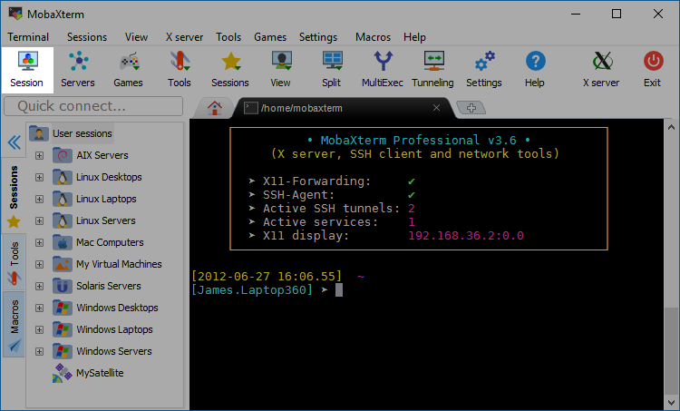

# Server usage {#server-usage}

## Why use the Ryten server?

The Ryten server is useful for a couple of reasons:

1.  They enable a common environment for all members of the Ryten lab to work on. You can easily share results without duplication or data that's too large to sit on your personal computers by sharing the path to the directory/file on the Ryten server. And data that lies in the server will extend beyond your time at the Ryten lab for future members to access.
2.  They allow you to conduct analysis that exceeds the computational resources of (or take extremely long on) your local computer. The Ryten server has \>20Tb of storage space, \~256Gb of RAM and 112 CPUs, though at times, even this will feel too small!

## Usage guide

The Ryten server is a shared between all Ryten lab members and we'd like to keep the experience of all user's as smooth and enjoyable as it can be. For this reason, we've set out a few guidelines you should follow when using the Ryten server:

1.  **Deleting files**: Especially for those just starting out with programming, be aware that when you connect to Ryten server you have access to all the data and scripts owned by other Ryten lab members. Some of these can be easily regenerated, however for others regeneration will be near impossible (e.g. raw RNA-seq data) or time-consuming. There are fail-safe measures in place to prevent deletion accidents such as setting permissions to read-only and [backing up our data](#data_backup). But **please take care when removing files**.
2.  **Shared directories**: The `/data` directory is where you should save common files that you expect will be used by others members of the lab. If you need to access something that seems general purpose (e.g. `GTF` files lie in `/data/references`) then it's possible that it exists already. If you've checked and it doesn't, then please add it in `/data`. Alternatively, if the data is project-specific then place it in your home directory (each user will have a `home` at the path `/home/user_name`).
3.  **Big jobs**: There's a possibility that you'll need run a process that will consume a large amount of memory and/or CPUs (potentially rendering the server unusable by others for a duration). This kind of run should be saved for jobs that are urgent (deadline fast approaching) or can **only** be run in such a way (e.g. requires loading in a huge object). If you're planning to run something that fits this criteria, please give a heads up to the others in the lab and try to miminize the server outage time (run over weekends).

## How to connect to a remote server?

There are two main ways to connect to the Ryten server, both involving the Secure Socket Shell (`ssh`) protocol. `ssh` is a popular method of connecting securely to a remote server using the command line.

For the Ryten server, we either:

- [Directly `ssh`](#connect-shell) in (for a shell/bash session)
- [Tunnel](#tunnel) in using `ssh` (to use RStudio Server or Jupyter Notebooks)

All of these methods are detailed below. They all require:

- **A user name and the host's IP address** (referred to as `user_name` and `ryten_server_IP` respectively below). If you don't have either of these, please ask one of the existing members.
- **Connection to eduroam or UCL's virtual private network**. See [guide](#ucl-vpn) below.
- **Access to a `terminal`**. You will already have this if you are on a Mac or Linux operating system. If you are on Windows, you will need an `ssh`client. See [guide](#windows-mobaxterm) below.

> If you do run into issues during this process, it's also most likely a problem with this guide (which we are still finalizing) rather than you. We'd really prefer if you ask rather than experiment as this helps us know which areas still need to be clarified and means we don't run into any unintentional server crashes.

### Setup UCL VPN {#ucl-vpn}

If you want to connect to the Ryten server whilst you're at home, in a coffee shop or anywhere outside of UCL (i.e. not connected to [eduroam](https://www.ucl.ac.uk/isd/services/get-connected/wi-fi-wireless-networks/eduroam-wi-fi-ucl)) then you need to first login to UCL's virtual private network each time you reconnect to the Ryten server. The official guide on how to do so can be found [here](https://www.ucl.ac.uk/isd/services/get-connected/ucl-virtual-private-network-vpn). The username and password for this are your UCL credentials (e.g. those you would use for Portico).

> Make sure your inputted vpn address is "vpn.ucl.ac.uk". There are other ucl vpn addresses such as "ucl-lmcb.ucl.ac.uk", however these will not grant you access to the Ryten server's IP.

Once you've successfully connected you should see the following:

```{r ucl-vpn-success, fig.cap = "Successful VPN connection example", echo = FALSE}
knitr::include_graphics('figures/03-Server-usage/ucl-vpn-success.png')
```

### Are you a Windows user? {#windows-mobaxterm}

If the answer is no and you're on a Mac or Linux operating system, then skip ahead to the [next section](#connect-shell). The `ssh` commands are required to be run on a local `terminal`, which isn't available by default on Windows.

To access a local `terminal` on Windows, we use the `ssh` client [mobaXterm](https://mobaxterm.mobatek.net/). Please download this and install it. To configure this to access the Ryten server, do the following:

1.  Click on the "Sessions" button to start a new session.

```{r session-button, fig.cap = "Screenshot of mobaXterm 'Sessions' button", echo = FALSE}

```

2.  Click on the SSH button in order to create a new SSH session. Every session you start will be automatically saved, so you will only have to do this once.

3.  In the "Remote host" field, enter the `ryten_server_IP` (ask one of the existing members if you don't this). You can optionally also specify your username (all this will mean is that you are not prompted for it when you access the server). Once done, click okay.

```{r session-screen, fig.cap = "Screenshot of mobaXterm 'Session settings' screen.", echo = FALSE}
knitr::include_graphics('figures/03-Server-usage/network-sessions-manager.png')
```

4.  The server will now appear in your saved sessions. Anytime you wish to access the server, simply double click on the saved session.

### Connecting via a shell session {#connect-shell}

One method to connect to the Ryten server is via an interactive shell/bash session. If you are using [mobaXterm on Windows](#windows-mobaxterm), it's advised you use their `sessions` feature rather than manually calling `ssh` from your local terminal.

This method is often used for things such as exploring the files/directories that exist on the server, checking what's currently running on the server using `top`, running non-`R` processes and setting up big runs that can continue even after you close your connection to server.

To do this use the command below from your **local** `terminal`:

```{r ssh-ryten-server, eval = FALSE}
ssh user_name@ryten_server_IP
```

This will open another `terminal`, on which you can do anything you would in your local `terminal`, however instead you'll be using the infrastructure of the Ryten server.

### Tunnelling into the server {#tunnel}

#### Connecting to RStudio Server {#connect-rserver}

The Ryten server has a continuously running, free version of [RStudio Server](https://rstudio.com/products/rstudio/download-server/) installed. This allows you to use the nice interface of RStudio, whilst accessing the computing infrastructure of the Ryten Server. This is most commonly what you'll be using when you want to write `R` code.

The Ryten server's RStudio Server is available via `localhost:8787`. In order to access this on our own machines, we link `localhost:8787` on the server to the same address on our local machines. This can be achieved by running the the command below in your **local** terminal:

> Make sure you run this from your **local** terminal and **NOT** from inside the server. If you are a Windows user, you can open a local terminal within mobaXterm. If you do accidentally run this from inside the server, do not fear, the problem can be resolved. Simply run `pkill -u user_name ssh` (where `user_name` represents your Ryten server `user_name`). This will kill all ssh commands run by you.

```{bash connect-rserver, eval = FALSE}
ssh -X -N -f -L localhost:8787:localhost:8787 user_name@ryten_server_IP
```

The easiest way to run this would be to copy the command above and replace `user_name` with your own and `ryten_server_IP` with the correct IP (ask one of the existing members if you don't have either). After you have run this command successfully (you'll be asked to enter your credentials the first time) then you can access the `RStudio Server` session via typing `localhost:8787` in the address bar on your internet browser. You will see a RStudio theme'd credential screen the first time round where you should enter your Ryten server `user_name` and password. After which, you should be all set! Enjoy :)

#### Connecting to Jupyter Notebooks

We are able to access Jupyter Notebooks using a similar principle, although it is important to note that this process has a **dependency on others in the lab**. Commands for the following are based on the following guide: https://towardsdatascience.com/running-jupyter-notebooks-on-remote-servers-603fbcc256b3.

> As with RStudio, make sure you run all of the following commands from your **local** terminal and **NOT** from inside the server.

1. This command run in your local terminal will `ssh` in to the Ryten server, and tell it to run the command in quotation marks. This sets a Jupyter Notebook running on the server. **Each user will have to modify `XXXX` in `--port=XXXX` to a port of their choice.** It is important that users choose a port that is NOT already used by an existing user/service. See the [port section](#ryten-ports) to see what ports are currently in use. 

```{bash setup-jnb, eval = FALSE}
nohup ssh -f user_name@ryten_server_IP "python3.7 -m jupyter notebook --no-browser --port=XXXX" 
>/dev/null 2>&1
```

2. The next command run in your local terminal will tunnel into the Ryten server allowing access to Jupyter Notebooks through `localhost:XXXX` on your local browser.

```{r tunnel-jnb, eval = FALSE}
ssh -N -f -L localhost:XXXX:localhost:XXXX user_name@ryten_server_IP
```

3. Once you are finished running Jupyter Notebooks, please make sure to **close your session**, with the following command. This will kill any instances of "jupyter" running on the server with the specified `user_name`. Remember to specify the username otherwise you may kill another user's jupyter instance.

```{bash kill-jnb, eval = FALSE}
ssh user_name@ryten_server_IP "pkill -u user_name jupyter"
```


#### Ports in use {#ryten-ports}

If your name is not on this list, but you are using a port for e.g. Jupyter Notebooks or R Studio server (via `rocker`), please inform a member of the Ryten lab so the port can be added to this list.

- RStudio server: 8787
- Aine: 8960
- David: 8932, 8888
- Karishma: 8965
- Regina: 8990, 8991
- Sainath: 8999

## Adding new users 

If you would like to add a new user to the Ryten server, please use the following commands. Importantly, you must use the `-s` flag to set the default shell to `/bin/bash`, otherwise new user's will not have [autocompletion enabled by default](https://www.digitalocean.com/community/questions/how-to-enable-tab-to-complete-for-new-users-in-ubuntu). 

```{r add-new-user, eval = FALSE}

# -m adds a home directory for the user in /home/username
# -s sets the default shell /bin/bash 
sudo useradd -m -s /bin/bash username
sudo passwd username

```

> In the case that the `-s` flag has been forgotten, you can ask one of the sudo-users to [manually change your shell](https://unix.stackexchange.com/questions/362894/why-am-i-not-able-to-change-the-shell-with-the-chsh-command) using the command `sudo usermod --shell /bin/bash username`.

