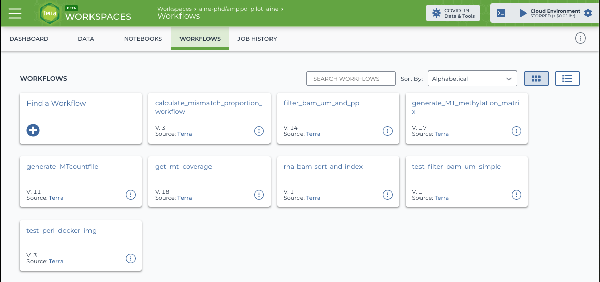

# Terra and Google Cloud  

## Introduction to Terra and Google Cloud
 
### General overview  

### Your account  

### The billing project  

### SQL queries  

## Using the Terra platform   

### General structure  

#### Workspaces

#### Dashboard  

#### Data  

#### Notebooks  

#### Workflows  

##### Why use workflows

In comparison to Terra Notebooks in which downstream analysis/processing takes place, the Terra workflow is for doing the heavy lifting aspects of your work. For example, if you need to use samtools to filter 1000 `.bam` files for properly paired reads, you would use a workflow to do this. Workflows are flexible and as well as the 1000s that are available via the Broad Institute's 'Broad Methods Repository', you can formulate your own pipelines using the intuitive Workflow Description Language (WDL). Implementing your chosen/custom workflow is made relatively simple by integration with the Terra data table structure, making it easy to define sample sets and other inputs, as well as being able to assign computing resources and run processes in parallel.  

In this section, I am not going to try to re-write the excellent Broad Institute -provided tutorials, but instead outline how you might approach using particular elements of Terra workflows, pointing to relevant tutorials along the way.  

##### The workflow view  

```{r Workflow-view, fig.cap = "The workflow tab", echo = FALSE}

```

Here you can see what the workflow tab looks like. This particular workspace has a collection of workflows, some of which are custom, others are imported from a workflow repository.  

To find or create a new workflow, click on 'Find a Workflow'. A pop-up will suggest some popular workflows, or there is the option to 'Find additional workflows'. To search for a workflow, select the relevant repository and import the workflow into your workspace. To generate your own, click on 'Broad Methods Repository'. You may need to sign in with your Google account here. Once you have done this, you will see the option to 'Create New Method' in the top right-hand corner. For more detail on how to create your own workflows, see [this](https://support.terra.bio/hc/en-us/articles/360031366091-Create-edit-and-share-a-new-workflow) Terra tutorial. Here, the process of workflow generation is covered, but building the actual WDL script that underlies it is not. I will link to some resources for this below.  

Returning to the workflow view, to use a workflow, simply select it's tile and you will be taken to the input view.  

### Get help

## Introduction to the AMP-PD data  